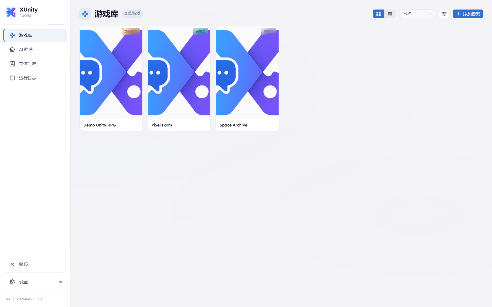
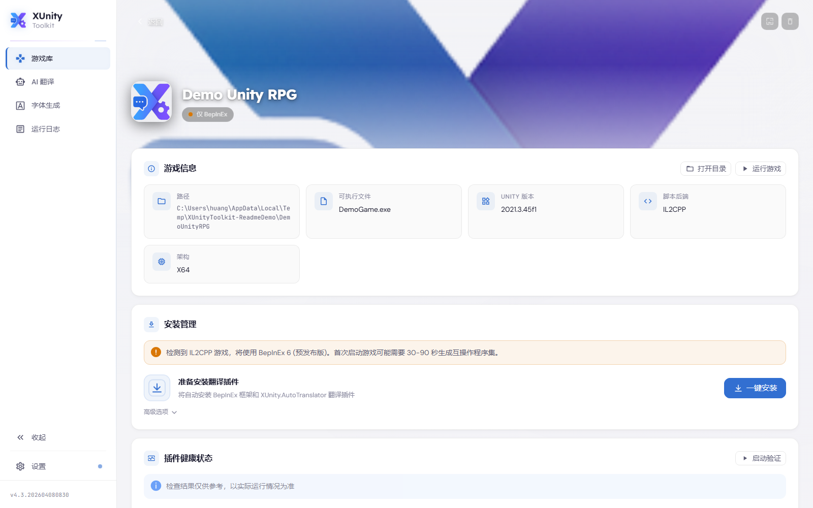
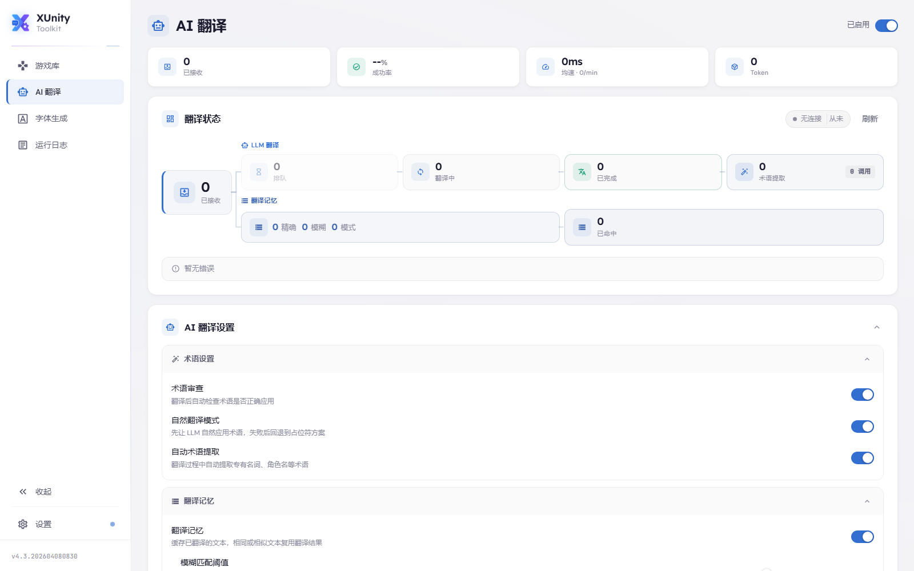
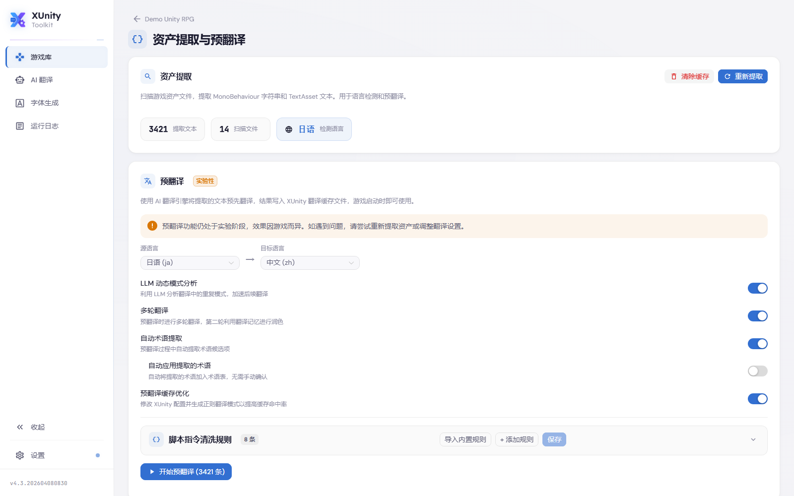
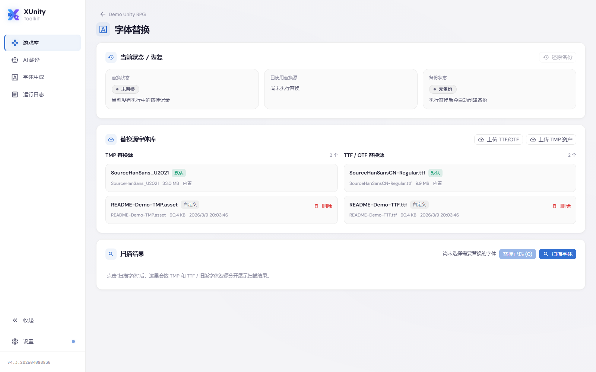

<div align="center">


# XUnityToolkit-WebUI

**面向 Unity 游戏汉化 / 翻译工作流的 Windows 桌面工具**

一键安装 BepInEx 与 XUnity.AutoTranslator，集成云端大模型、本地 llama.cpp、资产提取、预翻译、字体替换、术语管理与插件包导入导出。

[](LICENSE)
[](https://dotnet.microsoft.com/)
[](https://vuejs.org/)
[](https://www.typescriptlang.org/)
[](https://github.com/HanFengRuYue/XUnityToolkit-WebUI/releases)
[](https://github.com/HanFengRuYue/XUnityToolkit-WebUI/stargazers)

[下载发布版](https://github.com/HanFengRuYue/XUnityToolkit-WebUI/releases) · [报告问题](https://github.com/HanFengRuYue/XUnityToolkit-WebUI/issues) · [功能建议](https://github.com/HanFengRuYue/XUnityToolkit-WebUI/issues)

</div>

## 项目简介

XUnityToolkit-WebUI 适合需要给 Unity 游戏做机翻增强、术语约束、预翻译缓存、字体修复和插件分发的用户。发布版面向 Windows 10 / 11 x64，开箱即可运行；当你需要从源码开发时，也保留了完整的前后端项目结构。

## 下载与版本选择

<!-- DOWNLOAD_LINKS_START -->
| 版本 | ZIP 便携版 | MSI 安装包 |
|------|-----------|-----------|
| **Full（完整版）** | [下载](https://github.com/HanFengRuYue/XUnityToolkit-WebUI/releases/download/v4.9/XUnityToolkit-WebUI-v4.9-win-x64.zip) | [下载](https://github.com/HanFengRuYue/XUnityToolkit-WebUI/releases/download/v4.9/XUnityToolkit-WebUI-v4.9-win-x64.msi) |
| **No-LLAMA** | [下载](https://github.com/HanFengRuYue/XUnityToolkit-WebUI/releases/download/v4.9/XUnityToolkit-WebUI-v4.9-win-x64-no-llama.zip) | [下载](https://github.com/HanFengRuYue/XUnityToolkit-WebUI/releases/download/v4.9/XUnityToolkit-WebUI-v4.9-win-x64-no-llama.msi) |
| **Lite（精简版）** | [下载](https://github.com/HanFengRuYue/XUnityToolkit-WebUI/releases/download/v4.9/XUnityToolkit-WebUI-v4.9-win-x64-lite.zip) | [下载](https://github.com/HanFengRuYue/XUnityToolkit-WebUI/releases/download/v4.9/XUnityToolkit-WebUI-v4.9-win-x64-lite.msi) |
<!-- DOWNLOAD_LINKS_END -->

- **Full**：自包含，附带本地 AI 运行时与常用资源，适合大多数用户。
- **No-LLAMA**：自包含，只使用云端 API，不附带本地模型运行时。
- **Lite**：体积最小，需要先安装 [.NET 10 运行时](https://dotnet.microsoft.com/download/dotnet/10.0)。
- **本地 AI 适用环境**：NVIDIA 推荐 CUDA，AMD / Intel 推荐 Vulkan；没有独显也可走 CPU。

## 三分钟快速上手

1. 在 **游戏库** 中添加游戏目录，工具会检测 Unity 版本、Mono / IL2CPP、架构与可执行文件。
2. 打开 **游戏详情页**，使用 **一键安装** 自动部署 BepInEx、XUnity.AutoTranslator、AI 端点与推荐配置。
3. 进入 **AI 翻译** 页面，配置云端端点，或切换到 **本地 AI** 使用 llama.cpp 和本地 GGUF 模型。
4. 直接启动游戏开始实时翻译；文本量大的游戏建议先做 **资产提取 / 预翻译**，出现缺字时再做 **字体替换 / 字体生成**。

## 核心能力

- **一键接入翻译框架**：自动检测 Unity 游戏，安装 BepInEx 与 XUnity.AutoTranslator，并回写 AI 端点配置。
- **云端 AI 翻译**：支持 OpenAI、Claude、Gemini、DeepSeek、Qwen、GLM、Kimi 与自定义 OpenAI 兼容接口。
- **本地 AI 模式**：内置 llama.cpp，支持 HuggingFace / ModelScope 下载模型，也支持导入自有 GGUF。
- **资产提取与预翻译**：提取 `.assets` / AssetBundle 文本，写入预翻译缓存，适合 RPG、视觉小说等大文本游戏。
- **统一术语与翻译记忆**：支持术语候选、翻译记忆、动态模式、多轮翻译与术语审查。
- **字体与插件工具链**：支持 TMP + Legacy `Font` 替换、SDF 字体生成、插件健康检查、BepInEx 日志分析、插件包导入导出与在线更新。

<details>
<summary><strong>完整教程（点击展开）</strong></summary>

### 1. 添加游戏与安装翻译插件

- 游戏库支持单个添加，也支持批量扫描目录中的 Unity 游戏。
- 游戏详情页会展示 Unity 版本、脚本后端、架构、插件状态和快捷操作。
- **一键安装** 会按顺序处理翻译框架部署、AI 端点写入、推荐配置应用，以及可选的资产提取与健康检查。





### 2. 配置 AI 翻译

- **云端模式**：在 **AI 翻译** 页面添加端点，支持优先级、启停、模型名和测试。
- **本地模式**：切换到本地 AI 后，可根据显卡情况选择模型、下载运行时、启动 llama.cpp 服务。
- 如果你只想用自建兼容接口，可以直接使用 **Custom（OpenAI 兼容）**。



### 3. 资产提取与预翻译

- 工具会缓存提取结果，方便重复进入页面继续处理。
- 预翻译支持检测语言、缓存优化、LLM 动态模式分析、多轮翻译和自动术语提取。
- 完成后结果会写入 XUnity.AutoTranslator 缓存，适合需要“启动即出中文”的场景。



### 4. 字体替换与字体生成

- 字体替换支持 TMP 与 Legacy `Font` 两类资源。
- 可直接使用内置替换源，也可以上传自定义 TMP / TTF / OTF 资源。
- 字体生成页可基于 TTF / OTF 生成 TMP SDF 字体，并按字符集输出结果。



### 5. 术语、翻译编辑与插件包

- **术语编辑器**：管理翻译术语、禁翻词、分类、优先级、正则匹配与自动提取候选。
- **翻译编辑器**：对 AI 输出做人工校对，并支持导入 / 导出。
- **插件包导入导出**：打包当前游戏的翻译插件、缓存与配置，便于分发给其他玩家。
- **运行日志 / 健康检查**：排查 BepInEx 插件冲突、缺依赖、异常堆栈和兼容性问题。

</details>

## 常见问题

<details>
<summary><strong>我应该下载哪个版本？</strong></summary>

- 想省心，优先用 **Full**。
- 只打算使用云端 API，用 **No-LLAMA**。
- 追求最小体积且已经安装 .NET 10 运行时，用 **Lite**。

</details>

<details>
<summary><strong>云端 AI 和本地 AI 怎么选？</strong></summary>

- 云端模式配置简单、更新快，适合大多数用户。
- 本地模式更适合离线环境、长时间批量翻译，或不希望把文本发送到第三方接口的场景。
- 本地模式对显卡、显存和磁盘空间要求更高。

</details>

<details>
<summary><strong>翻译后出现方块字或缺字怎么办？</strong></summary>

- 先进入 **字体替换** 页面扫描当前字体资源。
- 如果游戏依赖的 TMP / Legacy `Font` 不包含中文字符，可直接替换为内置字体或上传自定义字体。
- 需要完全自定义时，再进入 **字体生成** 生成 TMP SDF 字体。

</details>

<details>
<summary><strong>什么时候应该使用预翻译？</strong></summary>

- 文本量大、重复文本多、首次进入游戏不希望等待实时机翻时，优先使用预翻译。
- 视觉小说、JRPG、带大量剧情文本的游戏最适合。
- 短流程游戏或只想快速试用时，可以先直接实时翻译。

</details>

<details>
<summary><strong>配置和缓存存在哪里？</strong></summary>

- 默认目录是 `%AppData%\\XUnityToolkit`。
- 可通过应用内的 **导出配置 / 导入配置** 做迁移或备份。
- 开发与维护层面的完整数据布局，请查看 [AGENTS.md](AGENTS.md)。

</details>

<details>
<summary><strong>可以把翻译成果发给别人吗？</strong></summary>

- 可以，优先使用 **插件包导出**。
- 它会把当前游戏的翻译插件、术语、缓存和部分相关配置打包出来，其他人可直接导入。

</details>

<details>
<summary><strong>开发者说明（点击展开）</strong></summary>

### 环境要求

- Windows 10 / 11 x64
- .NET 10 SDK
- Node.js 20.19+ 或 22.12+

### 常用命令

```bash
dotnet build XUnityToolkit-WebUI/XUnityToolkit-WebUI.csproj
dotnet build XUnityToolkit-WebUI/XUnityToolkit-WebUI.csproj -p:SkipFrontendBuild=true
dotnet run --project XUnityToolkit-WebUI/XUnityToolkit-WebUI.csproj

cd XUnityToolkit-Vue
npm run dev
npm run build
npx vue-tsc --build

cd ..
.\build.ps1
.\build.ps1 -SkipDownload
```

### 开发模式

- 后端默认监听 `http://127.0.0.1:51821`。
- 前端开发时也应代理到 `127.0.0.1`，不要改成 `localhost`。
- `XUnityToolkit-WebUI.csproj` 默认会在构建前自动执行前端安装与构建。

### 关键子项目

- `XUnityToolkit-WebUI/`：ASP.NET Core Minimal API + WinForms / WebView2 宿主
- `XUnityToolkit-Vue/`：Vue 3 + TypeScript + Naive UI 前端
- `TranslatorEndpoint/`：提供给 XUnity.AutoTranslator 调用的 `LLMTranslate.dll`
- `Updater/`：AOT 更新器
- `Installer/`：WiX 安装器

### 维护说明

- README 现在主要面向用户。
- 仓库维护、运行时数据布局、同步点和不变量统一记录在 [AGENTS.md](AGENTS.md)。
- 构建与发版流程调整时，需要同时检查 `build.ps1` 和 `.github/workflows/build.yml`。

</details>

## 许可证

本项目基于 [MIT License](LICENSE) 开源。
