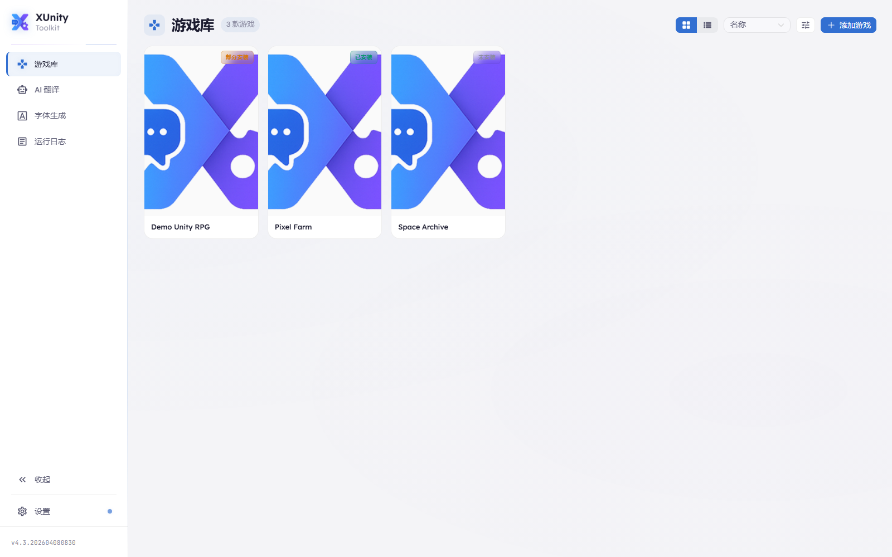
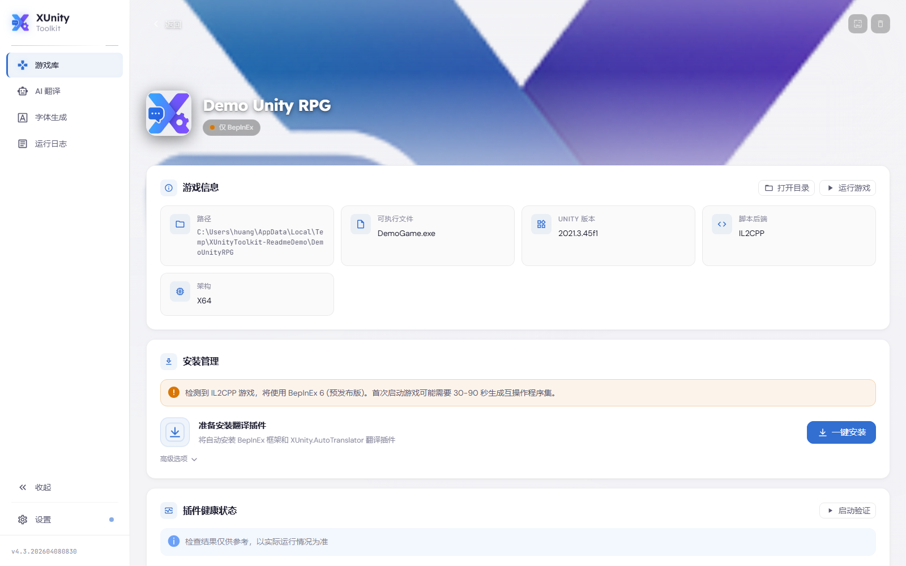
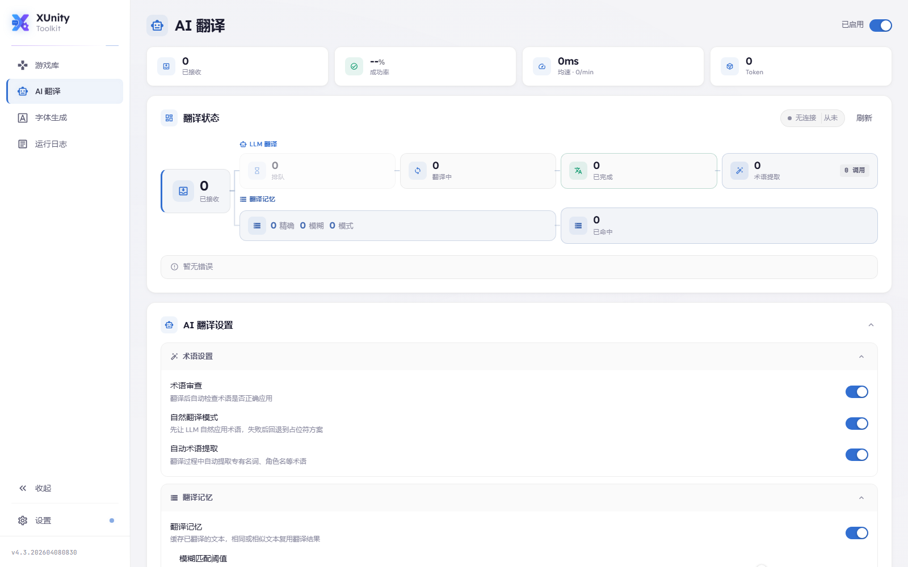
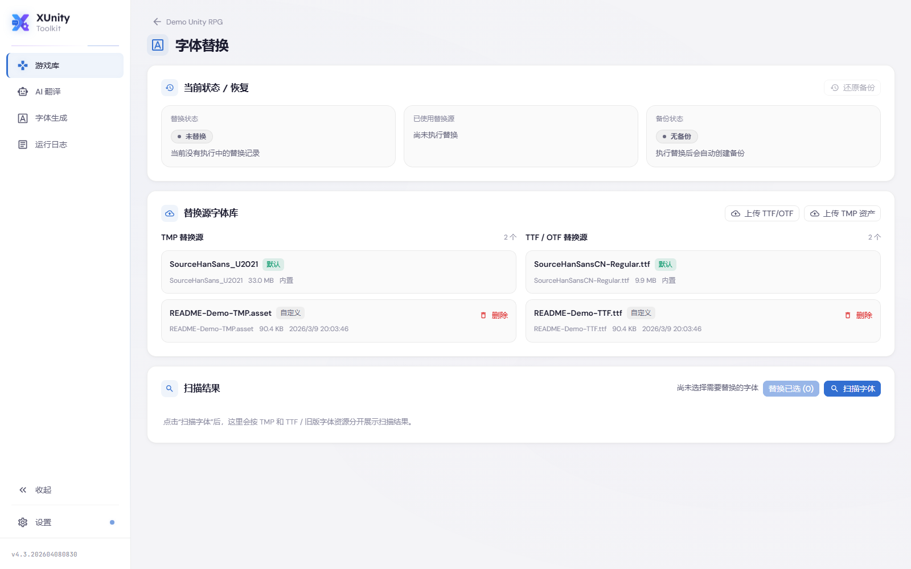

<div align="center">


# XUnityToolkit-WebUI

**面向 Unity 游戏汉化 / 翻译工作流的 Windows 桌面工具**

一键安装 BepInEx 与 XUnity.AutoTranslator，集成云端大模型、本地 llama.cpp、实时 AI 翻译、字体替换、术语管理与插件包导入导出。

[](LICENSE)
[](https://dotnet.microsoft.com/)
[](https://vuejs.org/)
[](https://www.typescriptlang.org/)
[](https://github.com/HanFengRuYue/XUnityToolkit-WebUI/releases)
[](https://github.com/HanFengRuYue/XUnityToolkit-WebUI/stargazers)

[下载发布版](https://github.com/HanFengRuYue/XUnityToolkit-WebUI/releases) · [报告问题](https://github.com/HanFengRuYue/XUnityToolkit-WebUI/issues) · [功能建议](https://github.com/HanFengRuYue/XUnityToolkit-WebUI/issues)

</div>

## 项目简介

XUnityToolkit-WebUI 适合需要给 Unity 游戏做实时机翻增强、术语约束、翻译记忆、字体修复和插件分发的用户。发布版面向 Windows 10 / 11 x64，开箱即可运行；当你需要从源码开发时，也保留了完整的前后端项目结构。

## 下载与版本选择

<!-- DOWNLOAD_LINKS_START -->
| 版本 | ZIP 便携版 | MSI 安装包 |
|------|-----------|-----------|
| **Full（完整版）** | [下载](https://github.com/HanFengRuYue/XUnityToolkit-WebUI/releases/download/v5.0/XUnityToolkit-WebUI-v5.0-win-x64.zip) | [下载](https://github.com/HanFengRuYue/XUnityToolkit-WebUI/releases/download/v5.0/XUnityToolkit-WebUI-v5.0-win-x64.msi) |
| **No-LLAMA** | [下载](https://github.com/HanFengRuYue/XUnityToolkit-WebUI/releases/download/v5.0/XUnityToolkit-WebUI-v5.0-win-x64-no-llama.zip) | [下载](https://github.com/HanFengRuYue/XUnityToolkit-WebUI/releases/download/v5.0/XUnityToolkit-WebUI-v5.0-win-x64-no-llama.msi) |
| **Lite（精简版）** | [下载](https://github.com/HanFengRuYue/XUnityToolkit-WebUI/releases/download/v5.0/XUnityToolkit-WebUI-v5.0-win-x64-lite.zip) | [下载](https://github.com/HanFengRuYue/XUnityToolkit-WebUI/releases/download/v5.0/XUnityToolkit-WebUI-v5.0-win-x64-lite.msi) |
<!-- DOWNLOAD_LINKS_END -->

- **Full**：自包含，附带本地 AI 运行时与常用资源，适合大多数用户。
- **No-LLAMA**：自包含，只使用云端 API，不附带本地模型运行时。
- **Lite**：体积最小，需要先安装 [.NET 10 运行时](https://dotnet.microsoft.com/download/dotnet/10.0)。
- **本地 AI 适用环境**：NVIDIA 推荐 CUDA，AMD / Intel 推荐 Vulkan；没有独显也可走 CPU。

## 三分钟快速上手

1. 在 **游戏库** 中添加游戏目录，工具会检测 Unity 版本、Mono / IL2CPP、架构与可执行文件。
2. 打开 **游戏详情页**，使用 **一键安装** 自动部署 BepInEx、XUnity.AutoTranslator、AI 端点与推荐配置。
3. 进入 **AI 翻译** 页面，配置云端端点，或切换到 **本地 AI** 使用 llama.cpp 和本地 GGUF 模型。
4. 直接启动游戏开始实时翻译；出现缺字时可使用 **字体替换 / 字体生成**，已有译文可在 **译文编辑器** 中校对。

## 核心能力

- **一键接入翻译框架**：自动检测 Unity 游戏，安装 BepInEx 与 XUnity.AutoTranslator，并回写 AI 端点配置。
- **本机连接自愈**：首选端口被占用时自动回退，游戏插件通过运行时发现文件重新连接；工具箱重启或实际端口变化后无需手工改 INI。
- **Windows 原生窗口**：桌面端使用 WinUI 3 + WebView2 原生壳，保留系统标题栏、`Win+Z`、Windows 11 分屏布局与贴靠组；业务网页和浏览器访问方式保持一致。
- **云端 AI 翻译**：支持 OpenAI、Claude、Gemini、DeepSeek、Qwen、GLM、Kimi 与自定义 OpenAI 兼容接口；OpenAI、DeepSeek、Qwen 及兼容服务可选 Responses API，并可按端点关闭或调整思考强度。
- **本地 AI 模式**：内置 llama.cpp，支持 HuggingFace / ModelScope 下载模型，也支持导入自有 GGUF。
- **统一术语与翻译记忆**：支持术语约束、精确/模糊翻译记忆与分阶段术语审查。
- **字体与插件工具链**：支持 TMP + Legacy `Font` 替换、SDF 字体生成、AI 驱动的 BepInEx 插件智能诊断、插件包导入导出与在线更新。

<details>
<summary><strong>完整教程（点击展开）</strong></summary>

### 1. 添加游戏与安装翻译插件

- 游戏库支持单个添加，也支持批量扫描目录中的 Unity 游戏。
- 游戏详情页会展示 Unity 版本、脚本后端、架构、插件状态和快捷操作。
- **一键安装** 会按顺序处理翻译框架部署、AI 端点写入、推荐配置应用与本地验证；安装流程只检查文件、新启动日志和工具箱 ping，不会调用模型或产生隐藏的 AI 费用。





### 2. 配置 AI 翻译

- **云端模式**：在 **AI 翻译** 页面添加端点，支持 API 格式、思考模式/强度、优先级、启停、模型名和连通性测试。
- **Responses API**：OpenAI、DeepSeek 与 Qwen 新端点默认使用 Responses；旧端点继续保留 Chat Completions，避免升级后静默改变请求格式。
- **关闭思考**：DeepSeek V4、OpenAI GPT-5.6、Qwen、GLM、Claude Sonnet 5 与 Kimi K2.6 会发送各自真实的关闭参数。Gemini 3 目前只能降到 `minimal`，Kimi K3 属于强制思考模型。
- **本地模式**：切换到本地 AI 后，可根据显卡情况选择模型、下载运行时、启动 llama.cpp 服务。
- 如果你只想用自建兼容接口，可以直接使用 **Custom（OpenAI 兼容）**。



### 3. 字体替换与字体生成

- 字体替换支持 TMP 与 Legacy `Font` 两类资源。
- 可直接使用内置替换源，也可以上传自定义 TMP / TTF / OTF 资源。
- 字体生成页可基于 TTF / OTF 生成 TMP SDF 字体，并按字符集输出结果。



### 4. 术语、翻译编辑与插件包

- **术语编辑器**：管理翻译术语、禁翻词、分类、优先级与正则匹配。
- **翻译编辑器**：对 AI 输出做人工校对，并支持导入 / 导出。
- **插件包导入导出**：打包当前游戏的翻译插件、缓存与配置，便于分发给其他玩家。
- **插件智能诊断**：打开游戏详情或 BepInEx 日志页时只刷新本地客观事实，不调用模型。手动点击“AI 智能诊断”后，第一阶段由 AI 从脱敏资料清单中选择关键日志/配置，第二阶段再依据带行号的证据生成问题、置信度和修复建议；“启动并智能诊断”还会先取得本次游戏启动日志和工具箱 ping。
- **资料安全边界**：诊断覆盖 BepInEx、XUnity、LLMTranslate 和第三方 BepInEx 插件。DLL 只读取程序集元数据与引用，不上传二进制、不执行插件；文本会限制在游戏目录白名单内并过滤重解析点、密钥、Token、用户名与绝对路径。两阶段模型调用可能产生当前端点的 API 费用，界面会在按钮旁明确提示。

</details>

## 常见问题

<details>
<summary><strong>我应该下载哪个版本？</strong></summary>

- 想省心，优先用 **Full**。
- 只打算使用云端 API，用 **No-LLAMA**。
- 追求最小体积且已经安装 .NET 10 运行时，用 **Lite**。

</details>

<details>
<summary><strong>云端 AI 和本地 AI 怎么选？</strong></summary>

- 云端模式配置简单、更新快，适合大多数用户。
- 本地模式更适合离线环境、长时间批量翻译，或不希望把文本发送到第三方接口的场景。
- 本地模式对显卡、显存和磁盘空间要求更高。

</details>

<details>
<summary><strong>翻译后出现方块字或缺字怎么办？</strong></summary>

- 先进入 **字体替换** 页面扫描当前字体资源。
- 如果游戏依赖的 TMP / Legacy `Font` 不包含中文字符，可直接替换为内置字体或上传自定义字体。
- 需要完全自定义时，再进入 **字体生成** 生成 TMP SDF 字体。

</details>

<details>
<summary><strong>提示端口占用，或开代理/加速器后游戏连不上怎么办？</strong></summary>

- `51821` 现在是“首选端口”。若它被其他程序占用或被系统保留，工具箱会自动选择新的本机端口，并通过 `%AppData%\\XUnityToolkit\\runtime\\toolbox-endpoint-v1.json` 告知新版 `LLMTranslate.dll`。
- 游戏与工具箱之间始终使用 `127.0.0.1` 且强制直连，不读取系统代理或 PAC；这不会改变工具箱访问云端 AI 时使用的代理设置。
- 普通系统代理通常不会再影响连接。若启用 TUN/全局加速后仍超时，请在健康检查中查看最后心跳与诊断原因，并尝试开启“绕过局域网/环回地址”。内核级过滤驱动仍可能拦截环回流量，代码无法保证绕过任意此类驱动。
- 工具箱设置页会同时显示首选端口和本次实际端口。修改首选端口会在下次启动生效，当前游戏配置继续使用实际地址。

</details>

<details>
<summary><strong>配置和缓存存在哪里？</strong></summary>

- 默认目录是 `%AppData%\\XUnityToolkit`。
- `runtime\\toolbox-endpoint-v1.json` 是当前运行实例的本机端点发现文件，会在正常退出时按实例归属清理。
- 可通过应用内的 **导出配置 / 导入配置** 做迁移或备份。
- 开发与维护层面的完整数据布局，请查看 [AGENTS.md](AGENTS.md)。

</details>

<details>
<summary><strong>可以把翻译成果发给别人吗？</strong></summary>

- 可以，优先使用 **插件包导出**。
- 它会把当前游戏目录中的翻译插件、译文文件和相关配置打包出来，其他人可直接导入。

</details>

<details>
<summary><strong>开发者说明（点击展开）</strong></summary>

### 环境要求

- Windows 10 / 11 x64
- .NET 10 SDK
- Node.js 20.19+ 或 22.12+

### 常用命令

```bash
dotnet build XUnityToolkit-WebUI/XUnityToolkit-WebUI.csproj
dotnet build XUnityToolkit-WebUI/XUnityToolkit-WebUI.csproj -p:SkipFrontendBuild=true
dotnet run --project XUnityToolkit-WebUI/XUnityToolkit-WebUI.csproj

cd XUnityToolkit-Vue
npm run dev
npm run build
npx vue-tsc --build

cd ..
.\build.ps1
.\build.ps1 -SkipDownload
```

### 开发模式

- 后端优先监听 `http://127.0.0.1:51821`；端口冲突时自动绑定其他本机端口，实际地址以运行时发现文件或“工具箱连接”卡片为准。
- 前端开发时也应代理到 `127.0.0.1`，不要改成 `localhost`。
- `XUnityToolkit-WebUI.csproj` 默认会在构建前自动执行前端安装与构建。

### 关键子项目

- `XUnityToolkit-WebUI/`：ASP.NET Core Minimal API + WinUI 3 / WebView2 原生宿主（WinForms 仅用于托盘图标）
- `XUnityToolkit-Vue/`：Vue 3 + TypeScript + Naive UI 前端
- `TranslatorEndpoint/`：提供给 XUnity.AutoTranslator 调用的 `LLMTranslate.dll`
- `Updater/`：AOT 更新器
- `Installer/`：WiX 安装器

### 维护说明

- README 现在主要面向用户。
- 仓库维护、运行时数据布局、同步点和不变量统一记录在 [AGENTS.md](AGENTS.md)。
- 构建与发版流程调整时，需要同时检查 `build.ps1` 和 `.github/workflows/build.yml`。

</details>

## 许可证

本项目基于 [MIT License](LICENSE) 开源。
